# XTMon System Specification & Architecture

## 1. Overview
**XTMon** (APS Actions XTarget Monitoring) is a Blazor Web App (Interactive Server render mode) built on **.NET 10** and deployed on **IIS**. Its primary purpose is to provide a comprehensive, real-time dashboard for monitoring SQL Server processing data, replaying failed processing flows, and scheduling and verifying JV calculations.

The application has a robust, layered architecture consisting of a Blazor UI frontend, a strongly-typed Configuration/Options layer, a Repository-based Data Access layer, Background Hosted Services for asynchronous polling and processing, and a UAM-based authorization layer. It employs a centralized Serilog pipeline writing back to SQL Server and local files.

## 2. Architecture Diagram

```mermaid
flowchart TD
    %% Define Styles
    classDef ui fill:#3b82f6,stroke:#1e3a8a,stroke-width:2px,color:#fff;
    classDef opt fill:#10b981,stroke:#064e3b,stroke-width:2px,color:#fff;
    classDef data fill:#f59e0b,stroke:#78350f,stroke-width:2px,color:#fff;
    classDef bg fill:#8b5cf6,stroke:#4c1d95,stroke-width:2px,color:#fff;
    classDef db fill:#64748b,stroke:#0f172a,stroke-width:2px,color:#fff;
    classDef external fill:#ef4444,stroke:#7f1d1d,stroke-width:2px,color:#fff;

    %% Client & Network Layer
    User("User Browser") -- "HTTPS / WSS (SignalR)" --> IIS["IIS + ASP.NET Core Module"]
    IIS --> AuthLayer["Windows Auth + UAM Policy"]
    
    %% UI Layer (Blazor Components)
    subgraph UILayer ["UI Layer - Blazor Server Components"]
        Home["Home.razor (Landing)"]
        MonitoringUI["Monitoring.razor"]
        DbBackupUI["DbBackupInfo.razor"]
        ReplayUI["ReplayFlows.razor"]
        JvCheckUI["JvCalculationCheck.razor"]
    end
    class Home,MonitoringUI,DbBackupUI,ReplayUI,JvCheckUI ui;
    
    AuthLayer --> Home
    AuthLayer --> MonitoringUI
    AuthLayer --> DbBackupUI
    AuthLayer -- "UamRestricted Policy" --> ReplayUI
    AuthLayer -- "UamRestricted Policy" --> JvCheckUI

    %% Options Layer
    subgraph ConfigurationLayer ["Options & Configuration"]
        MonitorOpt["MonitoringOptions"]
        ReplayOpt["ReplayFlowsOptions"]
        JvOpt["JvCalculationOptions"]
        AppSettings["appsettings.json"]
    end
    class MonitorOpt,ReplayOpt,JvOpt,AppSettings opt;
    
    AppSettings -. "Binds to" .-> MonitorOpt
    AppSettings -. "Binds to" .-> ReplayOpt
    AppSettings -. "Binds to" .-> JvOpt

    %% UI to Options Mapping
    MonitoringUI -. "Reads" .-> MonitorOpt
    ReplayUI -. "Reads" .-> ReplayOpt
    JvCheckUI -. "Reads" .-> JvOpt

    %% Data Access Layer
    subgraph DataLayer ["Data Access Layer (Repositories)"]
        SqlConnFact["SqlConnectionFactory"]
        MonitorRepo["MonitoringRepository"]
        ReplayRepo["ReplayFlowRepository"]
        JvRepo["JvCalculationRepository"]
    end
    class SqlConnFact,MonitorRepo,ReplayRepo,JvRepo data;

    SqlConnFact -- "Creates" --> MonitorRepo
    SqlConnFact -- "Creates" --> ReplayRepo
    SqlConnFact -- "Creates" --> JvRepo

    MonitoringUI -- "Calls" --> MonitorRepo
    ReplayUI -- "Calls" --> ReplayRepo
    JvCheckUI -- "Calls" --> JvRepo

    %% Background Processing Services
    subgraph BackgroundLayer ["Hosting Environment (IHostedService)"]
        ReplayQueue[("ReplayFlow Processing Queue")]
        ReplayService["ReplayFlowProcessingService"]
        JvService["JvCalculationProcessingService"]
    end
    class ReplayQueue,ReplayService,JvService bg;

    ReplayUI -- "Enqueues Token" --> ReplayQueue
    ReplayQueue -- "Dequeues Token" --> ReplayService
    ReplayService -- "Creates Scope & Calls" --> ReplayRepo
    JvService -- "Creates Scope & Polls" --> JvRepo

    %% Databases
    subgraph DatabaseLayer ["SQL Server Target Databases"]
        StagingFiAlmt[("StagingFiAlmt DB")]
        Publication[("Publication DB")]
        JobsDb[("JV Jobs DB")]
        LoggingDb[("LOG_FI_ALMT DB")]
        UamDb[("MAIN_UAM DB")]
    end
    class StagingFiAlmt,Publication,JobsDb,LoggingDb,UamDb db;

    AuthLayer -- "UspGetAdminUserByBnpId" --> UamDb

    MonitorRepo -- "Reads Metrics" --> StagingFiAlmt
    ReplayRepo -- "Read/Write Flows" --> StagingFiAlmt
    JvRepo -- "Check Values" --> Publication
    JvRepo -- "Reads/Writes Job State" --> JobsDb
    
    %% Serilog
    subgraph ObservabilityLayer ["Observability"]
        SerilogLog["Serilog Pipeline"]
        FileSink["Local File Sink"]
    end
    class SerilogLog,FileSink external;

    UILayer -. "Log Events" .-> SerilogLog
    DataLayer -. "Log Events" .-> SerilogLog
    BackgroundLayer -. "Log Events" .-> SerilogLog

    SerilogLog -- "SP: UspInsertAPSActionsLog" --> LoggingDb
    SerilogLog -- "xtmon-YYYYMMDD.log" --> FileSink
```



---

## 3. Core Functional Features
XTMon is divided into three major functional areas (features):

1. **Database & Infrastructure Monitoring** (`Monitoring.razor` & `DbBackupInfo.razor`)
   - Retrieves and visualizes general server metrics, such as database disk space and database backup completion status.
   - Dynamically parses structural data returned from flexible SQL stored procedures into dynamic grids and summary cards.

2. **Replay Flows** (`ReplayFlows.razor`)
   - A business operations capability. Users specify a specific  PNL Date to fetch a list of failed ETL/data flows.
   - Provides a mechanism to submit these failed flows for reprocessing ("Replaying").
   - Relies on an asynchronous background queue where the web UI enqueues a command, and a background service safely processes it against the database.
   - Polls for the replay status and visually displays process success/failure to the user.

3. **JV Calculation Checks** (`JvCalculationCheck.razor`)
   - Allows users to validate "JV" calculations against a specific, safe list of dates (fetched dynamically from the Database).
   - Utilizes a persistent job table in the SQL database to queue the JV Calculation task, where a dedicated background worker polls and executes it. 
   - After the background service completes the validation check, the UI presents a dynamic data grid displaying the structured query evaluation results and an optional executed SQL text.

---

## 4. Architecture Layers Context

The application is structured using a standard clean layer approach for Blazor.

### 4.1. User Interface (Components & Pages)
The UI is driven by Blazor Server (`InteractiveServerComponents`) and styled with **Tailwind CSS**. It incorporates centralized navigation (`App.razor`, `MainLayout.razor`, `NavMenu.razor`) with an environment indicator badge (DEV/PROD) in the sidebar.

- **Pages (`src/XTMon/Components/Pages/`)**:
  - `Home.razor`: Landing page with feature cards, quick-start guide, data sources overview, and help information.
  - `Monitoring.razor` / `DbBackupInfo.razor`: System monitoring dashboards with interactive grids.
  - `ReplayFlows.razor`: Complex data-entry and tabular status UI for failed flow resolution. **Requires APS entitlement.**
  - `JvCalculationCheck.razor`: Execution and validation UI for JV reporting. **Requires APS entitlement.**
- **Styling**: `tailwind.css` provides variables for full light/dark mode support.
- **Authorization UI**: `NavMenu.razor` uses `AuthorizeView Policy="UamRestricted"` to hide restricted pages from unauthorized users. The landing page feature cards also respect this policy.

### 4.2. Configuration (Options Layer)
XTMon uses the strongly-typed `IOptions<T>` pattern, heavily validated on application startup via `IValidateOptions` and Data Annotations.
- **`MonitoringOptions`**: Defines timeout values and SP names for general metrics (`UspGetDbSizePlusDisk`, `UspGetDBBackups`).
- **`ReplayFlowsOptions`**: Maps target connections (e.g., `StagingFiAlmt`), complex SP interactions (`UspGetFailedFlows`, `UspInsertReplayFlows`, `UspProcessReplayFlows`), table-types, and UI polling intervals.
- **`JvCalculationOptions`**: Maps connections for Pub and Job tables, and delineates the expansive list of SPs required for the enqueueing/heartbeating/executing states of a JV job.

### 4.3. Data Access (Repository Layer)
Direct database connection handling is abstracted away from the UI into domain-specific repositories acting on `Microsoft.Data.SqlClient`. 
- **`SqlConnectionFactory`**: Centralizes connection string retrieval and instantiation.
- **`MonitoringRepository`**: Reads dynamic schema results (`MonitoringTableResult`) from flexible monitoring SPs.
- **`ReplayFlowRepository`**: Maps rows to strongly typed models (`FailedFlowRow`, `ReplayFlowResultRow`, `ReplayFlowStatusRow`) and issues the table-valued parameter submissions.
- **`JvCalculationRepository`**: Implements a robust state-machine persistence layer. It enqueues jobs, `TryTakeNextJvJobAsync` claims jobs with a worker ID, and it maintains `HeartbeatJvJobAsync`, `FixJvCalculationAsync`, `CheckJvCalculationAsync`, and completion markers.

### 4.4. Background Services (Processing via Hosted Services)
One of XTMon's standout architectural patterns is the usage of `IHostedService` (specifically `BackgroundService`) to detach long-running SQL computations from the Blazor UI lifecycle.

1. **`ReplayFlowProcessingService`**
   - **Queue-based**: Depends on an in-memory `ReplayFlowProcessingQueue` (a thin wrapper over `Channel<T>`).
   - The Blazor UI triggers a processing request which adds a token to the queue.
   - The background service `DequeueAllAsync` unblocks, acquires a dependency injection scope using `IServiceScopeFactory`, creates a `ReplayFlowRepository`, and executes `ProcessReplayFlowsAsync`. 
   - This prevents web request thread exhaustion and allows for safe teardown on app shutdown.

2. **`JvCalculationProcessingService`**
   - **Database Polling-based**: Instead of an in-memory queue, it polls the SQL database (via `TryTakeNextJvJobAsync`) every 5 seconds.
   - If a job is found, it claims it. It performs heartbeats (`HeartbeatJvJobAsync`), attempts fixes if requested, executes the check (`CheckJvCalculationAsync`), saves structured JSON representations of the data grid to the database (`SaveJvJobResultAsync`), and marks it as complete/failed.
   - The Blazor UI (`JvCalculationCheck.razor`) continuously polls the database for this specific `JobId` to display the background worker's progress and final results.

---

## 5. Models (Data Transfer Objects)
The `src/XTMon/Models/` directory houses immutable C# `record` types used strictly for mapping SQL Output to UI state, ensuring thread safety inside Blazor Server:
- **Monitoring**: `MonitoringTableResult` encompasses a dynamic array of column names and a jagged list of string values.
- **Replay**: `FailedFlowRow`, `ReplayFlowResultRow`, `ReplayFlowSubmissionRow`, `ReplayFlowStatusRow`.
- **JV Check**: `JvJobRecord`, `JvCalculationCheckResult`, `JvJobEnqueueResult`, `JvPnlDatesResult`.

---

## 6. Security & Authorization

### 6.1. Authentication
- Windows Authentication via `NegotiateDefaults.AuthenticationScheme` (NTLM/Negotiate).
- When deployed on IIS, authentication is handled natively by IIS. Anonymous authentication must be disabled.
- Blazor provides a `CascadingAuthenticationState` to allow UI views to recognize user identities.

### 6.2. Authorization (UAM Policy)
The app uses a custom `UamRestricted` authorization policy that behaves differently per environment:

| Environment | Behavior |
|-------------|----------|
| **Production** | Calls `[uam].[UspGetAdminUserByBnpId]` on the `MAIN_UAM` database. User must have **Name "APS"** (APS entitlement) to access Replay Flows and JV Calculation pages. |
| **Development** | Policy is bypassed — all authenticated Windows users can access every page. |

**Key components:**
- `RequiresUamPermissionRequirement` — custom `IAuthorizationRequirement`.
- `UamPermissionHandler` — custom `IAuthorizationHandler` that queries the `UamAuthorizationRepository`.
- `UamAuthorizationRepository` — executes the UAM stored procedure against `MAIN_UAM`.

### 6.3. Environment Indicator
The sidebar displays a visual badge showing the current mode:
- **DEV** (amber) — authorization bypassed, all pages accessible.
- **PROD** (rose) — UAM authorization enforced, restricted pages hidden for unauthorized users.

---

## 7. Centralized Logging Pipeline
XTMon uses a two-pronged logging system based on **Serilog**:
1. **Asynchronous SQL Server Sink**: `StoredProcedureLogSink` writes all metrics tagged `Warning` and `Error` into a dedicated database `LOG_FI_ALMT` via `monitoring.UspInsertAPSActionsLog`. This allows DBAs to track the application's overall stability and failure rates in Replays/Jobs.
2. **Rolling File Sink**: A standard local file log (`logs/xtmon-YYYYMMDD.log`) acts as a persistent fallback for environment startup issues and comprehensive operational tracking.

### Error Handling
- The background services extensively wrap their processing loops in `try/catch` and pipe fatal internal execution errors (`AppLogEvents.ReplayProcessorBackgroundFailed`) straight to the Serilog pipeline so they are visible in the Central SQL logging tables.
- Blazor pages handle missing connections gracefully via surface UI error-state cards.

---

## 8. Build and Deployment

### 8.1. Build
- Built on **.NET 10**.
- Tailwind CSS compilation: `npm --prefix src/XTMon run build:css` compiles `src/XTMon/Styles/tailwind.css` → `src/XTMon/wwwroot/app.css`.
- Publish: `dotnet publish ./src/XTMon/XTMon.csproj -c Release -o ./publish`.

### 8.2. IIS Deployment
The app is deployed on **IIS** (Windows Server). The **ASP.NET Core Hosting Bundle** is a mandatory prerequisite.

> **IMPORTANT:** The .NET 10 **Hosting Bundle** must be installed on the server — not just the .NET SDK or Runtime. The Hosting Bundle registers `AspNetCoreModuleV2` with IIS, which is required for IIS to load and execute any ASP.NET Core application. Without it:
> - IIS cannot parse `web.config` (the `<aspNetCore>` element is unrecognized)
> - IIS Manager Authentication page shows "Retrieving status…" indefinitely
> - All requests return `401 2 5` (Access Denied) or `500`
> - No stdout logs are created
>
> After installing the Hosting Bundle, always run `iisreset` and verify with:
> ```powershell
> & "$env:windir\system32\inetsrv\appcmd.exe" list modules | findstr /I AspNetCore
> ```

Deployment steps:

1. Install the [.NET 10 **Hosting Bundle**](https://dotnet.microsoft.com/download/dotnet/10.0) on the server, then run `iisreset`.
2. Copy the published output to the IIS site directory.
3. Configure the IIS Application Pool with **.NET CLR Version = No Managed Code**.
4. Enable **Windows Authentication** and disable **Anonymous Authentication** in IIS.
5. Set `ASPNETCORE_ENVIRONMENT` in `web.config`:

```xml
<aspNetCore processPath=".\XTMon.exe" hostingModel="inprocess">
  <environmentVariables>
    <environmentVariable name="ASPNETCORE_ENVIRONMENT" value="Production" />
  </environmentVariables>
</aspNetCore>
```

Port, HTTPS, and SSL certificates are managed entirely by IIS site bindings.

### 8.3. Local Development
- `dotnet run --project ./src/XTMon/XTMon.csproj` — Development mode on port 7009 (UAM bypassed).
- `dotnet run --project ./src/XTMon/XTMon.csproj --launch-profile https-prod` — Production mode on port 7010 (UAM enforced).
- Launch profiles defined in `src/XTMon/Properties/launchSettings.json`.
